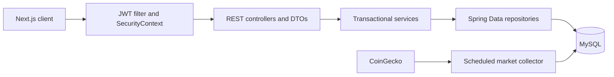

# HashWhale Core

Spring Boot REST API for HashWhale, a simulated digital-asset wallet, Earn, and collateralized-borrowing platform. It is designed as a full-stack engineering showcase: financial operations use a real transactional database ledger, while no blockchain transaction or real-money movement occurs.

The companion frontend is available in [hashwhale-web](https://github.com/donum01/hashwhale-web).

## Highlights

- Stateless JWT authentication with BCrypt password hashing
- BTC, ETH, and USDT wallet balances with simulated deposits and withdrawals
- BTC/ETH-collateralized USDT loans with server-side LTV validation
- Flexible, 30-day, and 90-day Earn positions with daily reward accrual
- Dashboard aggregation, loan-risk alerts, and rule-based recommendations
- Background CoinGecko collector backed by local historical-price tables
- Immediate startup refresh when the latest stored market snapshot is stale
- Country-based fiat conversion for the USDT chart
- OpenAPI documentation and a generated TypeScript contract for the frontend
- Reusable, opt-in interview demo-data seeder

## Technology

- Java 26
- Spring Boot 4.1.1 and Spring Framework 7
- Spring Data JPA and Hibernate
- Spring Security and JJWT
- MySQL 8 for local application data
- H2 for isolated tests
- springdoc-openapi
- Lombok
- Maven

## Architecture



Important design rules:

- Monetary values use `BigDecimal` and `DECIMAL(38,18)`, never binary floating-point types.
- API requests and responses use DTOs; JPA entities are not exposed directly.
- Controllers derive the user from the authenticated JWT rather than trusting a user ID supplied by the client.
- Balance-changing operations use transactions and pessimistic row locking.
- Enums are persisted by name rather than ordinal position.
- Market API requests read local history only; provider retry and rate-limit handling stay in the background worker.

## REST API

Swagger UI is available at `http://localhost:8080/swagger-ui.html` while the backend is running.

| Area | Endpoints |
| --- | --- |
| Authentication | `POST /api/auth/register`, `POST /api/auth/login`, `GET /api/auth/me` |
| Wallet | `GET /api/wallet/balances`, `POST /api/wallet/deposit`, `POST /api/wallet/withdraw`, `GET /api/wallet/transactions` |
| Borrow | `GET /api/borrow/configuration`, `GET /api/borrow/loans`, `POST /api/borrow/loans`, `POST /api/borrow/loans/{loanId}/repay` |
| Earn | `GET /api/earn/products`, `GET /api/earn/summary`, `GET /api/earn/positions`, `POST /api/earn/positions`, `POST /api/earn/positions/{positionId}/withdraw` |
| Dashboard | `GET /api/dashboard/summary` |
| Market | `GET /api/market/prices/{asset}/history?range=1D|7D|30D|90D` |

Only registration, login, Swagger, OpenAPI, and CORS preflight paths are public. All other endpoints require `Authorization: Bearer <token>`.

## Local setup

### Prerequisites

- JDK 26
- Docker Desktop or another MySQL 8 installation
- Maven, or the included Maven wrapper

### 1. Start MySQL

The default development configuration expects database `hashwhale`, user `root`, and password `hashwhale123`:

```powershell
docker run --name hashwhale-mysql `
  -e MYSQL_ROOT_PASSWORD=hashwhale123 `
  -e MYSQL_DATABASE=hashwhale `
  -p 3306:3306 `
  -d mysql:8
```

For later sessions:

```powershell
docker start hashwhale-mysql
```

### 2. Set the JWT secret

`JWT_SECRET` must contain a Base64-encoded key of at least 256 bits. One way to generate a temporary development key in PowerShell is:

```powershell
$jwtBytes = [byte[]]::new(32)
[System.Security.Cryptography.RandomNumberGenerator]::Fill($jwtBytes)
$env:JWT_SECRET = [Convert]::ToBase64String($jwtBytes)
```

Optionally set `COINGECKO_API_KEY` to increase the provider's rate allowance:

```powershell
$env:COINGECKO_API_KEY = "your-demo-api-key"
```

### 3. Run the backend

```powershell
.\mvnw.cmd spring-boot:run
```

The API starts at `http://localhost:8080`. If the newest stored price or fiat-rate snapshot is older than the configured five-minute refresh interval, the backend refreshes it immediately during startup and then continues the normal background schedule.

## Interview demo account

The guarded demo seeder removes all users and user-owned wallet, loan, Earn, and transaction records, then creates one realistic account. It deliberately preserves stored market prices and fiat exchange rates.

Stop any existing backend process, keep MySQL running, and execute:

```powershell
.\scripts\reset-demo-data.ps1
```

The script requires an explicit `RESET` confirmation and prompts for a masked password. It then starts the backend with the `demo` profile. The default login email is:

```text
demo@hashwhale.com
```

The seeded account contains three wallet balances, two loans, three Earn positions, and sixteen reconciled historical transactions. The seeder cannot run during normal startup because it requires the `demo` profile plus explicit enable and reset flags.

## Tests

```powershell
.\mvnw.cmd test
```

The current suite contains 59 unit and integration tests. Tests use an in-memory H2 datasource and do not connect to the development MySQL container.

Coverage includes:

- Authentication and country persistence
- CORS preflight and protected-route behavior
- Cross-user resource ownership
- Wallet locking and insufficient-balance paths
- LTV calculation and loan settlement
- Earn accrual, maturity, and withdrawal behavior
- Cursor-based history pagination
- Market collection, startup degradation, and local history queries
- Demo-data reconciliation and authentication

## Configuration

Application configuration lives in `src/main/resources/application.yaml`.

| Property group | Purpose |
| --- | --- |
| `app.jwt.*` | Signing secret and token lifetime |
| `app.borrow.*` | APR and LTV thresholds |
| `app.earn.products.*` | Supported products, terms, APYs, and minimums |
| `app.pricing.*` | Provider, refresh interval, retry policy, and fallback prices |
| `app.demo-seed.*` | Demo-only reset controls loaded through the `demo` profile |

## Scope and limitations

- Deposits, withdrawals, loans, and Earn positions modify only the internal ledger.
- JWT access tokens expire after 24 hours; refresh tokens are not implemented.
- The frontend currently stores the JWT in `localStorage`, which is appropriate only for this portfolio-scale demo.
- Hibernate uses `ddl-auto: update`; a production deployment should use versioned migrations.
- The local datasource password is committed for development convenience and should be externalized before deployment.
- CoinGecko can be unavailable or rate-limited without preventing authentication, wallet, Borrow, or Earn from working.

## License

See [LICENSE](LICENSE).
